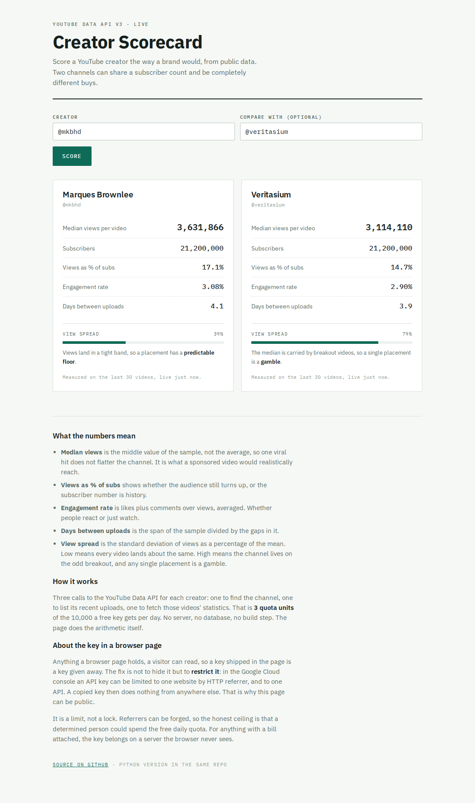

# creator-scorecard

Score creators the way a brand would, across platforms, from public data. Two channels can
share an audience number and be completely different buys.

```
$ python scorecard.py youtube:@mkbhd youtube:@veritasium

                      Marques Brownlee          Veritasium
                      YouTube @mkbhd            YouTube @veritasium
--------------------------------------------------------------------------
Audience                       21,200,000 subs           21,200,000 subs
Median reach               3,932,536 per video       3,115,869 per video
Engagement rate                          3.01%                     2.94%
Days between posts                         4.1                       3.9
Reach spread                               38%                       79%
--------------------------------------------------------------------------
Sample                                30 items                  30 items
```

Same audience to the nearest hundred thousand. Brownlee's reach spread is 38%, so his videos
land in a tight band and a placement has a predictable floor. Veritasium's is 79%, so a similar
median is carried by breakout videos and any single placement is a gamble. The audience number,
the one quoted in every media kit, is the least useful row in the table.

## The interesting problem

A YouTube subscriber and a Twitch follower aren't the same thing. Neither are views on a video
and views on a past broadcast. So putting two platforms in one table means deciding what the
merged number means.

The rule here: each platform fills what it can and says why the rest is blank. Nothing gets
estimated.

```
$ python scorecard.py youtube:@mkbhd twitch:pokimane

                      Marques Brownlee          pokimane
                      YouTube @mkbhd            Twitch pokimane
--------------------------------------------------------------------------
Audience                       21,200,000 subs             not available
Median reach               3,932,536 per video        152,383 per stream
Engagement rate                          3.01%             not available
Days between posts                         4.1                       5.6
Reach spread                               38%                       53%
--------------------------------------------------------------------------
Sample                                30 items                  30 items

What is missing, and why:
  Twitch. Followers: Twitch only gives a follower count to a token the
     creator has personally authorised, so an app token cannot see it.
  Twitch. Engagement rate: past broadcasts carry no public likes or
     comments, so there is nothing to divide by views.
```

Both blanks are real. Twitch only hands a follower count to a token the creator authorised
themselves, and past broadcasts carry no likes or comments to count. That's why companies buy
creator data rather than collecting it. The fields worth having need permission you haven't got.

## Two ways of proving who you are

The two platforms authenticate differently, and the difference is the point of the project.

| | YouTube | Twitch |
| --- | --- | --- |
| Credential | An API key | A client ID and secret |
| How it travels | On the query string | Swapped for a token, sent as a `Bearer` header |
| Lifetime | Until you revoke it | Weeks, then it expires and you swap again |
| The flow | None, it is just a password | OAuth client credentials grant |
| When it fails | The key is simply wrong | A 401, so you mint a new token and retry |
| Safe in a browser? | Yes, if restricted by referrer | **No.** The secret would be public |

In one line: a key is a password you keep sending, a token is something you are issued and that
runs out.

That last row is why the web version of this project is YouTube only. A browser page cannot hold
a secret, so anything needing one belongs on a server. This is the honest reason real products
have a backend.

## Layout

| File | What it does |
| --- | --- |
| `metrics.py` | The arithmetic, and the one schema both platforms have to fit. The interesting file |
| `youtube.py` | Fetches YouTube, converts it to that schema |
| `twitch.py` | Fetches Twitch, converts it to that schema, declares what it cannot get |
| `scorecard.py` | The command line, and reading credentials |
| `docs/` | The browser version, YouTube only. See below |

## Setup

```bash
pip install -r requirements.txt
cp .env.example .env      # then fill in your credentials
python scorecard.py youtube:@mkbhd
```

`.env` is gitignored. YouTube needs an API key from the Google Cloud console. Twitch needs an
application registered at `dev.twitch.tv/console`, which gives you a client ID and a secret.
`.env.example` has the steps for both.

**One key per use.** A YouTube key restricted to a website cannot be used from a command line,
because a command line sends no referrer. Restricting by IP address, or leaving a second key
unrestricted, is how you run both. The script says so if you get it wrong.

## Cost

| Call | Quota |
| --- | --- |
| Find the channel | 1 unit |
| List recent uploads | 1 unit |
| Fetch statistics for all of them, batched | 1 unit |

Three units per creator, out of the 10,000 a free YouTube key gets each day. Fetching each
video separately would cost 32 units for the same answer, which is what batching saves. Twitch
doesn't meter by credit, and the access token is cached in a gitignored file so it's only
requested once every couple of months.

A cached token eventually goes stale, so `twitch.py` treats a 401 as normal: it throws the
token away, asks for a new one, and retries the call once. That retry is the whole practical
difference between a token and a key. Tested by poisoning the cache with a dead token, which
the script recovers from without being told.

## What the numbers mean

| Row | How it is worked out | Why a brand cares |
| --- | --- | --- |
| Audience | Subscribers or followers, whichever the platform reports, labelled as such | The headline number, and the least informative one |
| Median reach | The middle value of the sample, not the average, so one viral hit does not flatter the channel | What a sponsored post would realistically reach |
| Engagement rate | Likes plus comments over views, averaged | Whether people react or just watch |
| Days between posts | The span of the sample divided by the gaps in it | Whether the channel is active and predictable |
| Reach spread | Standard deviation as a percentage of the mean | Low means every post lands about the same. High means the channel lives on the odd breakout |

## The web version



Live at **[joe-scan.github.io/creator-scorecard](https://joe-scan.github.io/creator-scorecard/)**.
Two files, `docs/index.html` and `docs/config.js`, plus Google Fonts. No server, no build step,
no libraries. YouTube only, for the reason in the auth table above.

Run it locally:

```bash
cd docs
python3 -m http.server 8000     # then open http://localhost:8000
```

### The key in a browser page

You can read the key in the published page. So can anyone. Hiding it isn't possible, so it's
restricted instead. In the Google Cloud console:

- **Application restrictions**, Websites, add the one site allowed to use it.
- **API restrictions**, Restrict key, YouTube Data API v3 only.

That stops a browser on another site from using it. It does not stop anyone with curl: send the
right `Referer` header by hand and the key works. I tested that too, and it returns data.

So referrer restriction is a speed bump, not a lock. The real ceiling is that someone determined
could spend the free daily quota, and nothing worse, because the key can only reach the YouTube
Data API. Put a bill on the other end and the key belongs on a server the browser never sees.

## Limits worth knowing

- **One page of results.** `youtube.py` has a `pageToken` loop but every caller passes
  `pages=1`, so that branch never actually runs. It takes the most recent 30. Deeper history
  means wiring the loop up and spending more quota.
- **Public data only.** No audience demographics, no location, no age split. That needs the
  creator's permission or a paid provider.
- **Instagram and TikTok are not here.** Both need app review and a business account, which is
  weeks of waiting rather than an afternoon.
- **The data is live.** Numbers move between runs, so anything quoted needs the date it was
  pulled.
